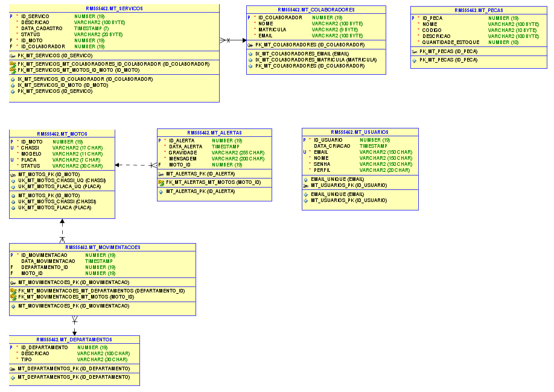
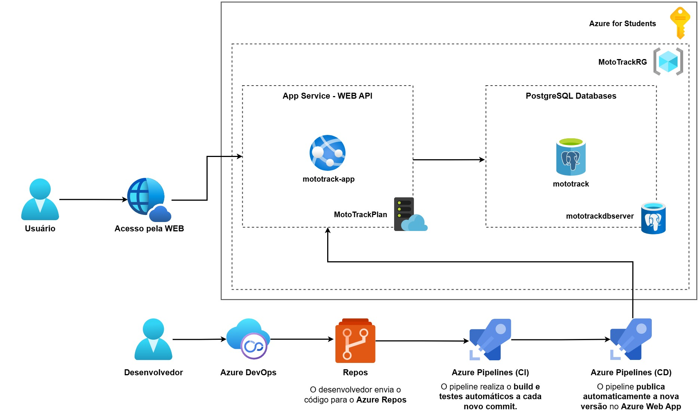

# 🏍️ MotoTrack - Cloud

## 👥 Integrantes

- **Felipe Ulson Sora** – RM555462 – [@felipesora](https://github.com/felipesora)
- **Augusto Lope Lyra** – RM558209 – [@lopeslyra10](https://github.com/lopeslyra10)
- **Vinicius Ribeiro Nery Costa** – RM559165 – [@ViniciusRibeiroNery](https://github.com/ViniciusRibeiroNery)

## 📌 Sumário

- [📝 Descrição da Solução](#-descrição-da-solução)
- [🗄️ Modelagem do Banco de Dados](#️-modelagem-do-banco-de-dados)
- [🚀 Como Rodar o Projeto MotoTrack Completo](#-como-rodar-o-projeto-mototrack-completo)
- [☁️ Detalhes do Projeto em Cloud](#️-detalhes-do-projeto-em-cloud)
- [🚀 Como Fazer o Deploy em Cloud (Azure)](#️-como-fazer-o-deploy-em-cloud-azure)
- [📹 Demonstração em Vídeo](#-demonstração-em-vídeo)

## 📝 Descrição da Solução

O **MotoTrack** é um sistema completo desenvolvido para auxiliar empresas de aluguel de motos, como a Mottu, no **controle e monitoramento de sua frota**.
A aplicação foi criada para resolver problemas comuns de gestão, como a desorganização nos pátios, dificuldade em localizar motos disponíveis ou em manutenção,
e a falta de histórico rastreável de movimentações e serviços.

O sistema também oferece funcionalidades para **gerenciamento de serviços e manutenções**, vinculando cada atividade a um **colaborador responsável**
, além de permitir o **controle de estoque de peças**, garantindo reposição eficiente e visibilidade dos recursos da empresa.

### O sistema permite:

- 📝 **Cadastro e gestão de motos**;
- 🏢 **Organização por departamentos**, facilitando a localização de veículos;
- 🔄 **Controle de movimentações**, com histórico detalhado;
- 🛠️ **Gestão de serviços e manutenções**, vinculando responsáveis por cada atividade;
- 👨‍🔧 **Registro de colaboradores** envolvidos nos serviços;
- 📦 **Controle de estoque de peças**;
- 🚨 **Disparo de alertas** para acompanhamento do status das motos.

### Estrutura da Solução

O projeto foi dividido em múltiplos módulos para facilitar **escalabilidade e integração**, cada um com responsabilidades específicas:

- ⚙️ **Backend REST em Java (Spring Boot)** – gerencia as entidades de **usuário, moto, movimentações e alertas**, utilizando **Spring Security com JWT** para autenticação e autorização.
- 🖥️ **Backend MVC em Java (Spring MVC)** – oferece as mesmas entidades do backend REST Java, com um **frontend web bonito e funcional**, permitindo cadastro, edição, listagem e exclusão de dados diretamente pelo navegador. Possui **Spring Security** com validação de tipo de usuário (**Administrador** e **Comum**) para controlar o acesso às funcionalidades.
- 🧩 **Backend REST em .NET (ASP.NET Core)** – gerencia as entidades de **moto (somente leitura das tabelas criadas pelo Java), colaboradores, serviços e peças**, integrando funcionalidades complementares ao sistema.
- 📱 **Frontend Mobile (React Native/Expo)** – consome ambas as APIs (Java e .NET) e disponibiliza **telas de cadastro, edição, exclusão e visualização** das funcionalidades, incluindo serviços, colaboradores e estoque de peças.
- 🗄️ **Banco de Dados Oracle** – utilizado por todos os backends, com **criação automática de tabelas** ao iniciar os projetos.
- ☁️ **Cloud (Azure)** – responsável por hospedar o **Backend MVC Java** e o **banco de dados PostgreSQL**, utilizando **Azure App Service** para a aplicação e **Azure Database for PostgreSQL** para persistência. Essa camada garante **acessibilidade, escalabilidade e disponibilidade** do sistema em ambiente de nuvem.

---

## 🗄️ Modelagem do Banco de Dados

Abaixo está a modelagem das tabelas utilizadas pelo sistema:



---

## 🚀 Como Rodar o Projeto MotoTrack Completo

Para utilizar o **MotoTrack** de forma completa, é necessário rodar simultaneamente três módulos:

1. **⚙️ Backend API REST em Java (Spring Boot)** – fornece os endpoints REST para o sistema.
2. **🧩 Backend API REST em .NET (ASP.NET Core)** – fornece funcionalidades complementares via API.
3. **📱 Frontend Mobile (React Native/Expo)** – aplicação mobile que consome ambas as APIs e exibe todas as funcionalidades, incluindo serviços, colaboradores e estoque de peças.
   > O **Backend MVC em Java (Spring MVC)** pode ser executado separadamente. Ele permite:
   >
   > - **📝 Login e cadastro de usuários;**
   > - **🏍️ Cadastro, listagem, edição e exclusão de motos;**
   > - **🔄 Cadastro, listagem e exclusão de movimentações e alertas.**

### 🛠️ Passo a Passo

1. Clone todos os repositórios:

   - [API Rest Java](https://github.com/mototrack-challenge/mototrack-backend-rest-java)
   - [API Rest .NET](https://github.com/mototrack-challenge/mototrack-backend-rest-dotnet)
   - [Mobile](https://github.com/mototrack-challenge/mototrack-frontend-mobile)
   - [MVC Java](https://github.com/mototrack-challenge/mototrack-backend-mvc-java)
   - [Cloud](https://github.com/mototrack-challenge/mototrack-cloud)

2. 🔌 Configure as credenciais de conexão com o banco Oracle nos arquivos de configuração dos backends, se necessário.

   - ✅ O banco de dados e as tabelas serão **criados automaticamente** ao iniciar os backends (Java REST, Java MVC e .NET)

3. 🚀 Rode os backends

   - Java REST: `mvn spring-boot:run` ou rode pelo IDE favorito
   - .NET REST: `dotnet run` ou abra no Visual Studio

4. 📱 Rode o frontend mobile:
   - Navegue até a pasta do projeto e execute `npm install` para instalar dependências
   - Execute `npx expo start` para abrir o app no emulador ou dispositivo físico

> ⚠️ Dica: primeiro inicie os backends para que o mobile consiga se conectar às APIs corretamente

5. 🖥️ Para testar o **MVC Java**, basta executar o projeto normalmente; ele funciona isoladamente, sem depender dos outros módulos

### ☁️ Opcional: Deploy em Cloud (Azure)

Também é possível executar o **MotoTrack MVC Java** diretamente na nuvem, utilizando **Azure App Service** e **Azure Database for PostgreSQL**.

- O passo a passo completo para realizar o deploy está descrito no repositório:  
  👉 [MotoTrack Cloud](https://github.com/mototrack-challenge/mototrack-cloud)

---

## ☁️ Detalhes do Projeto em Cloud

O **MotoTrack Cloud** é a versão do projeto **MVC Java** implantada na nuvem utilizando os serviços da **Microsoft Azure**.

O objetivo foi tornar a aplicação acessível de forma **remota**, **automatizada** e **escalável**, garantindo **alta disponibilidade**, **integração contínua** e **entrega automatizada**.

### 🛠️ Tecnologias e Serviços Utilizados

O deploy em cloud utilizou os seguintes recursos principais:

- **Azure App Service** – hospedagem do projeto **Spring MVC Java**, permitindo escalabilidade automática e gerenciamento simplificado.
- **Azure Database for PostgreSQL** – banco de dados relacional totalmente gerenciado na nuvem.
- **Azure DevOps** – plataforma completa utilizada tanto para **gestão ágil do projeto (Boards e Backlogs)** quanto para **automação CI/CD (Repos e Pipelines)**.
- **Azure Repos** – repositório Git que armazena o código-fonte do projeto e integra com os pipelines de CI/CD.
- **Azure Pipelines** – responsável por executar o processo de build (CI) e deploy (CD) de forma automatizada no **App Service**.
- **Java 17** – versão utilizada na aplicação.
- **Maven** – build e gerenciamento de dependências.

### 🧩 Componentes da Arquitetura Cloud

| **Nome do Componente**    | **Tipo**                                    | **Descrição Funcional**                                      | **Tecnologia / Ferramenta**       |
| ------------------------- | ------------------------------------------- | ------------------------------------------------------------ | --------------------------------- |
| **Repositório de Código** | SCM (Source Code Management)                | Onde o código-fonte está versionado                          | **GitHub**                        |
| **Pipeline CI**           | Orquestrador de CI (Continuous Integration) | Compila o projeto e executa testes automáticos a cada commit | **Azure DevOps Pipelines**        |
| **Pipeline CD**           | Orquestrador de CD (Continuous Delivery)    | Realiza o deploy automático da aplicação na nuvem            | **Azure DevOps Pipelines**        |
| **Banco de Dados**        | PaaS (Platform as a Service)                | Armazena os dados da aplicação de forma gerenciada           | **Azure Database for PostgreSQL** |
| **Web App**       | App Service                       | Local onde a aplicação roda e é disponibilizada publicamente | **Azure Web App**                 |
| **Gestão Ágil**           | Project Management                          | Organização de Sprints, tarefas e backlog do time            | **Azure Boards (DevOps)**         |


### 📐 Desenho da Arquitetura em Cloud



### ⚙️ Estrutura do Deploy e Automação (CI/CD)

- O **desenvolvedor** envia o código para o **Azure Repos**, onde o repositório Git centraliza a versão mais recente do projeto.

- O **pipeline de CI (Continuous Integration)** é acionado automaticamente a cada commit, realizando **build**, **testes** e **validações do código**.

- Após a validação, o **pipeline de CD (Continuous Delivery)** realiza o **deploy automático** da aplicação no **Azure App Service**, tornando a nova versão disponível imediatamente.

- As **variáveis de ambiente** (URL do banco, usuário e senha) são configuradas diretamente no App Service, garantindo **segurança e portabilidade**.

- O **banco de dados Oracle local** foi substituído por um **PostgreSQL na Azure**, configurado com acesso remoto e segurança em nível de conexão.

### 🧩 Gestão Ágil com Azure DevOps

Além da automação de deploy, o **Azure DevOps** também foi utilizado para a gestão do projeto:

- O **Azure Boards** organizou as Sprints, tarefas e histórias de usuário seguindo o modelo **Ágil/Scrum**.

- O **Backlog** permitiu priorizar demandas e acompanhar o progresso de cada integrante da equipe.

- Essa integração entre **gestão ágil** e **CI/CD** garantiu um fluxo contínuo de desenvolvimento, testes e entrega de novas versões.

### 📝 Funcionalidades Disponíveis na Nuvem

Na versão em cloud, o sistema mantém todas as funcionalidades do **MVC Java**:

- ✅ Login e cadastro de usuários
- 🏍️ Cadastro, edição, listagem e exclusão de motos
- 🔄 Cadastro, listagem e exclusão de movimentações
- 🚨 Cadastro, listagem e exclusão de alertas
- 📊 Visualização de histórico e status das motos

### 🌐 Acesso ao Sistema

Após o deploy, a aplicação ficou acessível por meio de uma **URL pública gerada pelo App Service**, permitindo que qualquer usuário autenticado consiga utilizar o sistema remotamente.

### 📊 Benefícios da Arquitetura em Cloud

- 🌍 **Acesso remoto** de qualquer lugar
- ⚙️ **Automação com CI/CD** via Azure DevOps
- 📈 **Escalabilidade automática** via App Service
- 🔒 **Segurança e gerenciamento** simplificados pela Azure
- ⚡ **Alto desempenho** com banco de dados gerenciado (PostgreSQL)

> ⚠️ O uso combinado de **Azure DevOps**, **Repos**, **Pi** e **App Service** proporcionou uma experiência completa de **integração e entrega contínua (CI/CD)**, simulando o ciclo real de deploy de uma aplicação corporativa em um ambiente de **Cloud Computing**.

---

## ☁️ Como Fazer o Deploy em Cloud (Azure)

O **MotoTrack Cloud** pode ser implantado na **Microsoft Azure** de duas formas:

1️⃣ **Manual**, via **Azure CLI**, ou

2️⃣ **Automatizada**, via **CI/CD com Azure DevOps**.

> 💡 **Importante**: ambas as opções exigem a **criação prévia do banco de dados** via **Azure CLI**.

### 1️⃣ Clonar o Repositório

Clone o projeto disponível no GitHub:

```bash
git clone https://github.com/mototrack-challenge/mototrack-cloud.git
cd mototrack-cloud
```

### 2️⃣ Preparar o Ambiente

- Instale o **Azure CLI**, caso ainda não tenha.
- Faça login na sua conta Azure:

```bash
az login
```

- Confirme se o login foi realizado corretamente:

```bash
az account show
```

### 3️⃣ Criar o Banco de Dados na Azure

1. Criar um **Resource Group**:

```bash
az group create --name MotoTrackRG --location brazilsouth
```

2. Criar um **servidor PostgreSQL**:

```bash
az postgres flexible-server create --resource-group MotoTrackRG --name mototrackdbserver --location brazilsouth --admin-user adminuser --admin-password "MotoTrack123!" --tier Burstable --sku-name standard_b1ms --storage-size 32 --version 15 --public-access All
```

3. Criar um **banco de dados** dentro do servidor:

```bash
az postgres flexible-server db create --resource-group MotoTrackRG --server-name mototrackdbserver --database-name mototrack
```

4. Obter a **URL do servidor**:

```bash
az postgres flexible-server show --resource-group MotoTrackRG --name mototrackdbserver --query "fullyQualifiedDomainName"
```

5. Conectar no banco via **pgAdmin4** (ou psql), usando a URL, usuário e senha.
   - Abra o banco `mototrack`
   - Execute o script SQL disponível no repositório: `script_bd.sql`

### 🚀 Opção 1 – Deploy Automatizado (CI/CD via Azure DevOps)

O processo de deploy automatizado utiliza o **Azure DevOps** para integração e entrega contínua **(CI/CD)**.
Essa abordagem é ideal para times que desejam manter **automatização**, **versionamento** e **rastreabilidade** durante o ciclo de desenvolvimento.

#### 🔧 Etapas do Web App

1. Criar um **App Service Plan**:

```bash
az appservice plan create --name MotoTrackPlan --resource-group MotoTrackRG --sku B1 --is-linux
```

2. Criar o **App Service com JDK 17**:

```bash
az webapp create --resource-group MotoTrackRG --plan MotoTrackPlan --name mototrack-app --runtime "JAVA:17-java17"
```

3. Configurar as **variáveis de ambiente do App Service**:

```bash
az webapp config appsettings set --resource-group MotoTrackRG --name mototrack-app --settings DB_URL="jdbc:postgresql://mototrackdbserver.postgres.database.azure.com:5432/mototrack" DB_USER="adminuser" DB_PASSWORD="MotoTrack123!"
```

#### 🔧 Etapas do Pipeline

1- **Azure Repos**
O desenvolvedor envia o código para o repositório Git hospedado no **Azure Repos**.

2- **Pipeline de CI (Continuous Integration)**
      - É acionado automaticamente a cada *commit* ou *pull request*;
      - Executa o **build** do projeto com **Maven**;
      - Valida o código e gera o arquivo `.jar` da aplicação.

3- **Pipeline de CD (Continuous Delivery)**
      - Após o CI ser concluído com sucesso, o CD realiza o **deploy automático** no **Azure Web App**;
      - As variáveis de ambiente e credenciais do banco de dados são configuradas no App Service;
      - O novo build é disponibilizado automaticamente na URL pública.

4- **Azure Boards**
      - Gerencia as **Sprints**, **tarefas** e **backlog**, integrando o fluxo de trabalho ágil ao pipeline CI/CD.

> 💡 **Vantagens**: automação completa, integração com controle de versão, histórico de builds e deploys e rastreabilidade entre código e tarefas do projeto.

### ⚙️ Opção 2 – Deploy Manual via Azure CLI

Para ambientes de teste ou aprendizado, é possível realizar o deploy manualmente via **Azure CLI**.

#### 1️⃣ Conferir a Versão do JDK

Antes de gerar o build, é importante garantir que o projeto esteja rodando com o **JDK 17** (necessário para o deploy no App Service).

No **IntelliJ IDEA**:

1. Vá em `File > Project Structure > Project`.
2. Em **Project SDK**, selecione o **Java 17** (se não aparecer, adicione manualmente).
3. Certifique-se de que o **Project language level** também esteja configurado para `17 - Sealed types, always-strict floating-point semantics`.

⚠️ Caso o JDK 21 ou outra versão esteja como padrão, altere para **17** para evitar erros de compatibilidade no build e no deploy.

#### 2️⃣ Criar o App Service

1. Configurar variáveis de ambiente na **máquina local**:

Antes de gerar o .jar, defina as mesmas variáveis de ambiente do App Service na sua máquina:
```bash
DB_URL = "jdbc:postgresql://mototrackdbserver.postgres.database.azure.com:5432/mototrack"
DB_USER = "adminuser"
DB_PASSWORD = "MotoTrack123!"
```
> 🔄 Reinicie o computador para que as alterações entrem em vigor.

2. Gerar o `.jar` do projeto:

```bash
mvn clean package
```

3. Criar um **App Service Plan**:

```bash
az appservice plan create --name MotoTrackPlan --resource-group MotoTrackRG --sku B1 --is-linux
```

4. Criar o **App Service com JDK 17**:

```bash
az webapp create --resource-group MotoTrackRG --plan MotoTrackPlan --name mototrack-app --runtime "JAVA:17-java17"
```

5. Configurar as **variáveis de ambiente do App Service**:

```bash
az webapp config appsettings set --resource-group MotoTrackRG --name mototrack-app --settings DB_URL="jdbc:postgresql://mototrackdbserver.postgres.database.azure.com:5432/mototrack" DB_USER="adminuser" DB_PASSWORD="MotoTrack123!"
```

5. Fazer o **deploy da aplicação**:

```bash
az webapp deploy --resource-group MotoTrackRG --name mototrack-app --src-path target/mototrack-backend-java-0.0.1-SNAPSHOT.jar --type jar
```

### 🌐 Acessar a Aplicação

Após o deploy, a aplicação estará disponível publicamente em uma URL gerada pelo **App Service**, no formato:

```bash
https://mototrack-app.azurewebsites.net
```

> ⚠️ Lembre-se: o banco de dados **PostgreSQL** precisa estar ativo e com as tabelas criadas (via script SQL) antes de rodar a aplicação em cloud.

---

## 📹 Demonstração em Vídeo

Para visualizar o **MotoTrack MVC Java** em funcionamento na **Azure**, assista aos vídeos abaixo — cada um demonstra um método diferente de deploy:

### ⚙️ Opção 1 – Deploy Manual via Azure CLI

🎥 [Deploy Manual via Azure CLI](https://www.youtube.com/watch?v=BvK2NWAhHi4)

Neste vídeo, é mostrado o **passo a passo completo de criação e configuração na nuvem**, incluindo:

- Como **criar o banco de dados PostgreSQL** na Azure
- Configuração do **App Service** e variáveis de ambiente
- Deploy do projeto Java para o App Service
- Testes das principais funcionalidades:
  - Login e cadastro de usuários (admin e comum)
  - Cadastro, edição, listagem e exclusão de motos
  - Cadastro, listagem e exclusão de movimentações e alertas
- Navegação pelas telas do sistema diretamente pelo navegador, mostrando que o projeto está rodando na nuvem

### 🚀 Opção 2 – Deploy Automatizado via CI/CD (Azure DevOps)

🎥 [Deploy Automatizado via CI/CD (Azure DevOps)](https://www.youtube.com/watch?v=BvK2NWAhHi4)

Este vídeo apresenta o processo de **integração e entrega contínua (CI/CD)** configurado no **Azure DevOps**, com:

- Como **criar o banco de dados PostgreSQL** na Azure
- Configuração do **App Service** e variáveis de ambiente
- Envio de código para o **Azure Repos**
- Execução automática do **pipeline de build (CI)**
- **Publicação automatizada** no **App Service (CD)**
- Testes das principais funcionalidades:
  - Login e cadastro de usuários (admin e comum)
  - Cadastro, edição, listagem e exclusão de motos
  - Cadastro, listagem e exclusão de movimentações e alertas
- Navegação pelas telas do sistema diretamente pelo navegador, mostrando que o projeto está rodando na nuvem


> ⚠️ **Importante**: para acompanhar os vídeos e testar o projeto, o **banco PostgreSQL** e o **App Service** precisam estar **ativos e configurados previamente**, conforme o passo a passo da seção de deploy.
